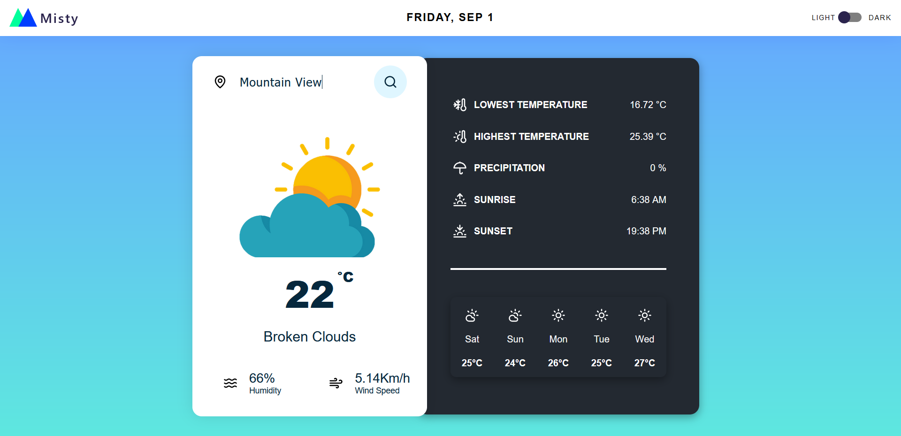

## Misty

A clean UI modern weather app built with Angular and TypeScript.

Check it out here: [https://misty-weather.vercel.app/](https://misty-weather.vercel.app/)

### Features

- Dark mode and Light mode
- Search for a location(city) to see it's basic weather now in a clean card view with nice illustartion.

### Technologies

### How to run

- Clone this repository to your local system.
- cd to the project directory on terminal and type `npm install` followed by `ng serve`
- Go to url: http://localhost:4200 in your browser to check out the app.

### Preview

  

### Support Development

  

